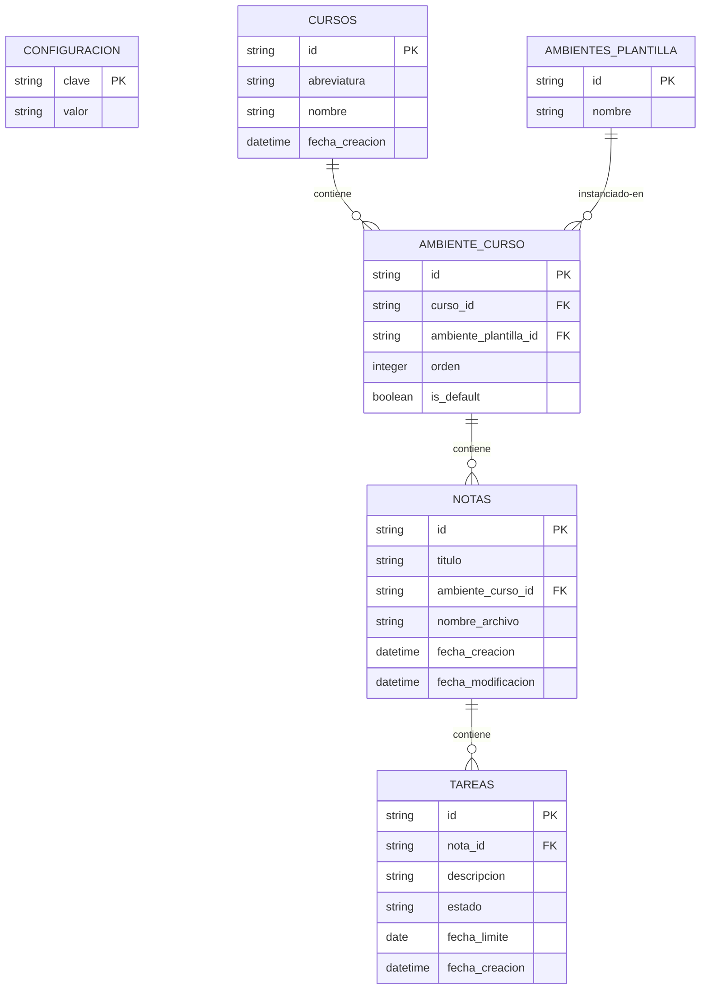

# 🗄️ Diseño de Base de Datos y Persistencia - Notitas

Este documento define la estructura de datos, el esquema físico de SQLite, las decisiones de diseño arquitectónico y la interfaz de comunicación (IPC) entre el Frontend (React) y el Backend (Tauri/Rust) para el proyecto **Notitas**.

---

## 👁️ Decisiones Clave de Diseño

### 1. Relación Curso-Ambiente mediante `ambiente_curso`
Para evitar redundancias y mantener la integridad referencial, se ha diseñado un modelo basado en plantillas:
*   **Plantillas Globales (`ambientes_plantilla`)**: Tabla estática que contiene los nombres estándar de las columnas de trabajo (ej. "Teoría", "Laboratorio", "Práctica").
*   **Tabla Intermedia (`ambiente_curso`)**: Representa la instancia de un ambiente dentro de un curso específico.
*   *Ventaja*: Eliminamos el campo `nombre` redundante en la tabla de relaciones, obteniendo el nombre directamente de la plantilla a través de un `JOIN`.

### 2. Guardado de Notas: Base de Datos + Sistema de Archivos
*   **Base de Datos (SQLite)**: Almacena los metadatos de las notas y las asocia a una columna activa de un curso mediante `ambiente_curso_id`.
*   **Sistema de Archivos (Ficheros `.md`)**: El texto escrito de la nota se guarda en un archivo físico en la carpeta local `apuntes_md`.
*   **Nomenclatura**: Los archivos físicos se guardan bajo el UUID de la nota (ej. `8f3b2a1a-4c2d-4eef-9311-2b22cc994411.md`). Esto evita tener que renombrar archivos en disco cuando el usuario edite el título de la nota desde la interfaz de usuario.

### 3. Sistema de Tareas Integrado en Notas (Markdown-First)
Para soportar una experiencia fluida y sin ratón, las tareas se escriben directamente dentro de los archivos markdown de las notas usando una sintaxis especial. El sistema analiza el archivo en cada guardado para sincronizar la base de datos.
*   **Sintaxis en el Archivo Markdown**:
    Cualquier línea que comience con `:Tarea` se considerará una tarea.
    ```markdown
    :Tarea [estado] Descripción de la tarea [@AAAA-MM-DD]
    ```
    *   **Estados**:
        *   `[ ]` o vacío $\rightarrow$ Sin completar (`sin_completar`)
        *   `[/]` $\rightarrow$ Iniciada / En proceso (`iniciada`)
        *   `[x]` o `[X]` $\rightarrow$ Completada (`completada`)
    *   **Fecha Límite (Opcional)**: Indicada con el prefijo `@` seguido de una fecha en formato `AAAA-MM-DD` al final de la línea.
    *   *Ejemplos*:
        ```markdown
        :Tarea [ ] Subir avance del informe @2026-06-01
        :Tarea [/] Codificar consultas complejas de base de datos
        :Tarea [x] Instalar dependencias del frontend @2026-05-25
        ```
*   **Estrategia de Sincronización (Markdown-First)**:
    1.  El archivo físico `.md` es la **fuente de verdad**.
    2.  Cada vez que se guarda una nota, el parser lee el archivo, busca las líneas que comienzan con `:Tarea`, extrae su descripción, estado y fecha límite.
    3.  El sistema limpia las tareas previas asociadas a esa `nota_id` en la tabla `tareas` y registra la lista actualizada en una sola transacción rápida en la base de datos local SQLite.
    4.  **Acción desde la UI**: Si el usuario marca una tarea como completada en un panel visual del Dashboard o del Curso, la aplicación actualiza la línea respectiva en el archivo `.md` de la nota y re-ejecuta el guardado/sincronización. Esto mantiene el archivo markdown legible y perfectamente consistente.

---

## 🗃️ Esquema Físico (SQLite)

El backend de Rust ejecutará y migrará el siguiente esquema físico:



### Tabla 1: `configuracion`
```sql
CREATE TABLE IF NOT EXISTS configuracion (
    clave TEXT PRIMARY KEY,
    valor TEXT NOT NULL
);
```

### Tabla 2: `ambientes_plantilla`
```sql
CREATE TABLE IF NOT EXISTS ambientes_plantilla (
    id TEXT PRIMARY KEY,
    nombre TEXT NOT NULL
);

INSERT OR IGNORE INTO ambientes_plantilla (id, nombre) VALUES 
('1', 'Teoría'),
('2', 'Laboratorio'),
('3', 'Práctica'),
('4', 'Proyecto'),
('5', 'Seminario');
```

### Tabla 3: `cursos`
```sql
CREATE TABLE IF NOT EXISTS cursos (
    id TEXT PRIMARY KEY,
    abreviatura TEXT NOT NULL,
    nombre TEXT NOT NULL,
    fecha_creacion DATETIME DEFAULT CURRENT_TIMESTAMP
);
```

### Tabla 4: `ambiente_curso`
```sql
CREATE TABLE IF NOT EXISTS ambiente_curso (
    id TEXT PRIMARY KEY,
    curso_id TEXT NOT NULL,
    ambiente_plantilla_id TEXT NOT NULL,
    orden INTEGER DEFAULT 0,
    is_default BOOLEAN NOT NULL DEFAULT 0,
    FOREIGN KEY(curso_id) REFERENCES cursos(id) ON DELETE CASCADE,
    FOREIGN KEY(ambiente_plantilla_id) REFERENCES ambientes_plantilla(id) ON DELETE RESTRICT
);
```

### Tabla 5: `notas`
```sql
CREATE TABLE IF NOT EXISTS notas (
    id TEXT PRIMARY KEY,
    titulo TEXT NOT NULL,
    ambiente_curso_id TEXT NOT NULL,
    nombre_archivo TEXT NOT NULL,
    fecha_creacion DATETIME DEFAULT CURRENT_TIMESTAMP,
    fecha_modificacion DATETIME DEFAULT CURRENT_TIMESTAMP,
    FOREIGN KEY(ambiente_curso_id) REFERENCES ambiente_curso(id) ON DELETE CASCADE
);
```

### Tabla 6: `tareas`
Almacena las tareas indexadas desde las notas para consultas rápidas agregadas (ej. listados globales en el Dashboard).
```sql
CREATE TABLE IF NOT EXISTS tareas (
    id TEXT PRIMARY KEY, -- UUID
    nota_id TEXT NOT NULL,
    descripcion TEXT NOT NULL,
    estado TEXT NOT NULL DEFAULT 'sin_completar', -- 'sin_completar', 'iniciada', 'completada'
    fecha_limite DATE, -- Formato YYYY-MM-DD o NULL
    fecha_creacion DATETIME DEFAULT CURRENT_TIMESTAMP,
    FOREIGN KEY(nota_id) REFERENCES notas(id) ON DELETE CASCADE
);
```

---

## 📡 Interfaz de Comunicación IPC (Tauri Commands)

### 1. Gestión de Cursos
*   `obtener_cursos()` $\rightarrow$ Retorna los cursos y sus columnas.
*   `crear_curso(abreviatura: String, nombre: String, ambientes_plantilla_ids: Vec<String>)` $\rightarrow$ Crea un curso y sus columnas en `ambiente_curso`.
*   `eliminar_curso(id: String)` $\rightarrow$ Elimina el curso de la DB y limpia sus archivos markdown.

### 2. Gestión de Notas
*   `obtener_notas_por_columna(ambiente_curso_id: String)` $\rightarrow$ Retorna las notas de una columna.
*   `crear_nota(titulo: String, ambiente_curso_id: String)` $\rightarrow$ Crea la nota en DB y el archivo físico `{UUID}.md`.
*   `eliminar_nota(id: String)` $\rightarrow$ Borra de la DB y elimina el archivo físico.

### 3. Sincronización y Contenido de Notas
*   `guardar_contenido_nota(id: String, contenido: String)` $\rightarrow$ 
    1.  Escribe el texto en `{id}.md`.
    2.  **Parser de Tareas**: Lee las líneas que inician con `:Tarea`, extrae los campos (`estado`, `descripcion`, `fecha_limite`).
    3.  Limpia las tareas existentes de esa nota en la base de datos y re-inserta las nuevas.
*   `leer_contenido_nota(id: String)` $\rightarrow$ Retorna el texto de `{id}.md`.

### 4. Consulta Global de Tareas (Para Dashboard y Vistas Agregadas)
*   `obtener_tareas_pendientes()` $\rightarrow$ Retorna todas las tareas con estado `sin_completar` o `iniciada`, unidas al nombre del curso y título de la nota respectiva (útil para el panel global del Dashboard).
    ```sql
    SELECT t.*, n.titulo AS nota_titulo, c.abreviatura AS curso_abreviatura
    FROM tareas t
    JOIN notas n ON t.nota_id = n.id
    JOIN ambiente_curso ac ON n.ambiente_curso_id = ac.id
    JOIN cursos c ON ac.curso_id = c.id
    WHERE t.estado != 'completada'
    ORDER BY t.fecha_limite ASC, t.fecha_creacion DESC;
    ```
*   `obtener_tareas_por_curso(curso_id: String)` $\rightarrow$ Retorna las tareas pertenecientes a un curso específico.
*   `actualizar_estado_tarea_en_markdown(tarea_id: String, nuevo_estado: String)` $\rightarrow$ 
    Modifica el estado en el archivo markdown físico y en la base de datos.
